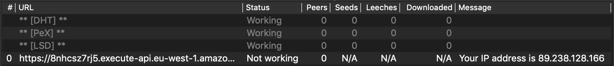

# Torrent IP Checker

A fake Torrent which allows you to see your IP address.

[Download the Torrent here](https://8nhcsz7rj5.execute-api.eu-west-1.amazonaws.com/Prod/torrent)

## Overview

### Why?

This allows you validate your VPN or proxy is functioning as expected and masking your real IP address.

### How does it work?

This Torrent contains a single HTTP tracker. The tracker returns a failure response to any request but includes your IP address as part of the failure reason.

To update the IP address you just have to reannounce to the tracker. Your BitTorrent client should allow you to do this. For example, in qBittorrent you just right click the torrent and select `Force reannounce`.

Here's a screenshot from qBittorrent:

## Local development

### Dependencies

- Yarn - https://yarnpkg.com/en/docs/install

### Invoking Lambda locally

First run `yarn`. This will fetch all of the necessary dependencies.

`yarn test` will run the unit tests.

`yarn dev` will execute the Lambda locally using mock data from `local/data.json`. This uses Serverless to execute the Lambda locally using an approximated AWS environment, the result is printed in the console.

### Deploying

This project uses the [Serverless Framework](https://serverless.com/) to define serverless resources and deploy the Lambda function.

Use this [Serverless Framework Credentials Guide](https://serverless.com/framework/docs/providers/aws/guide/credentials/) to help you set up AWS credentials. If you need to run `serverless` on the command line install it globally first: `yarn global add serverless`.

Once you've set up credentials run `yarn deploy` to build and deploy the Lambda to your AWS account.
